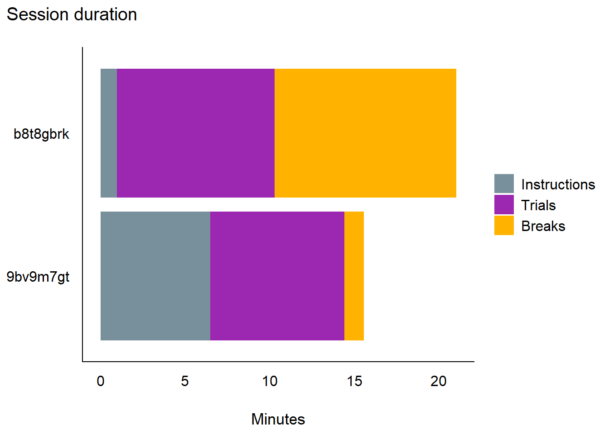
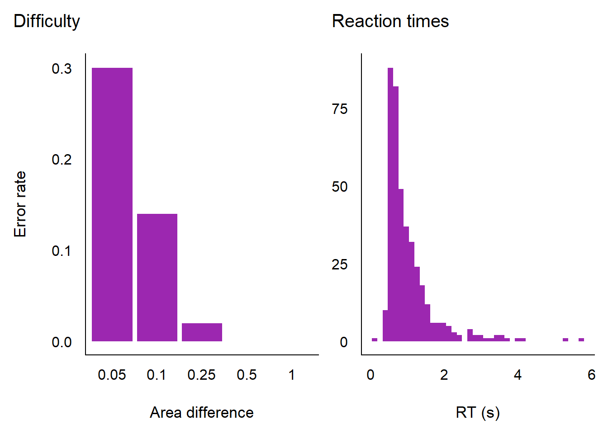
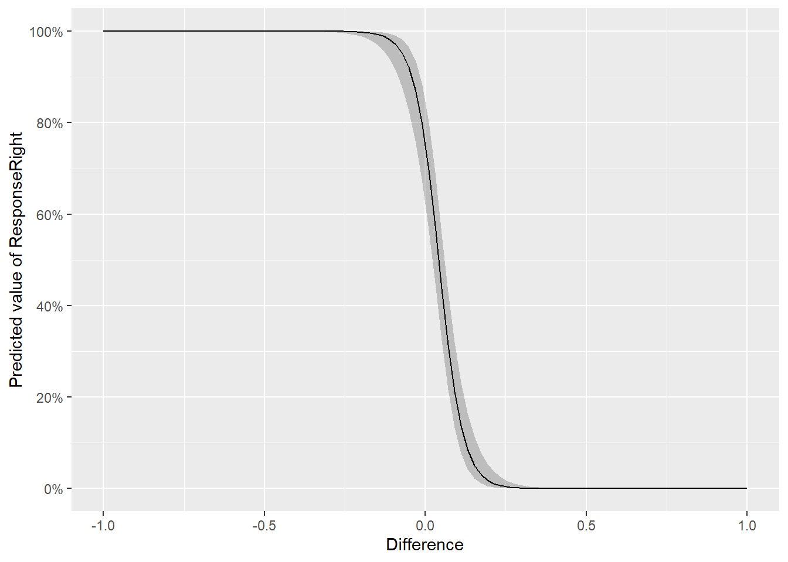
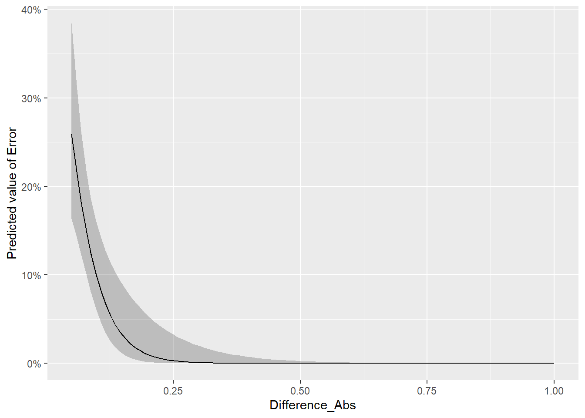
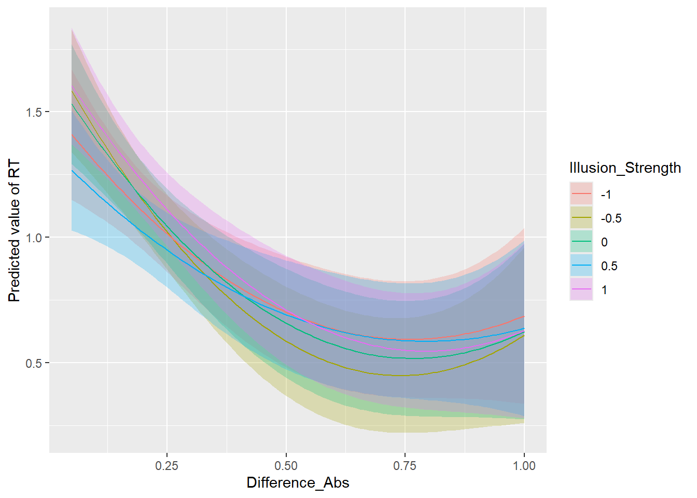

## Packages


::: {.cell}

```{.r .cell-code}
library(jsonlite)
library(tidyverse)
library(easystats)
library(patchwork)
```
:::


## Data

Each session of the task (`experiment/`) is saved as one JSON container with `session`,
`demographics`, `design` and `trials`. Every trial carries the full Pyllusion parameter
dictionary it was rendered from, so the design does not have to be reconstructed here - it is
read off the trials.

Sessions come from two places: `data/pilots/` (files downloaded from the task's end screen, in
the repo) and `data/raw/` (sessions saved to Zenodo through DataPipe, fetched by
`data/download.py`, git-ignored). Test runs (`test_...`) and the partial files of people who
stopped partway (`....partial.json`, a different format) are left out.


::: {.cell}

```{.r .cell-code  code-fold="false"}
path <- c("../data/pilots", "../data/raw")
```
:::


### Reading one session

The only awkward entries are the colours, which are RGB triplets rather than scalars; they
are collapsed to `"r,g,b"` strings, as the task's own CSV export does. `null` (the
`size_panel` "fill" level, and the tap coordinates of keyboard responses) becomes `NA`.


::: {.cell}

```{.r .cell-code  code-fold="false"}
# One JSON entry -> one value fit for a dataframe column
as_column <- function(x) {
  if (is.null(x) || length(x) == 0) return(NA)
  if (length(x) > 1) return(paste(unlist(x), collapse = ","))  # RGB triplets
  x[[1]]
}

read_session <- function(file) {
  d <- jsonlite::fromJSON(file, simplifyVector = FALSE)

  # One row per trial: the trial-level fields, then the parameter dictionary
  trials <- map(d$trials, function(trial) {
    fields <- trial[setdiff(names(trial), "parameters")]
    as_tibble(map(c(fields, trial$parameters), as_column))
  }) |>
    list_rbind()

  # Session and demographics are constant within a file, so repeat them on every row
  meta <- c(map(d$session, as_column), map(d$demographics, as_column))
  trials |> mutate(!!!meta, .before = 1)
}
```
:::


### All sessions


::: {.cell}

```{.r .cell-code  code-fold="false"}
files <- list.files(path, pattern = "\\.json$", full.names = TRUE)
files <- files[!grepl("\\.partial\\.json$", files) & !startsWith(basename(files), "test_")]

df <- map(files, read_session) |>
  list_rbind() |>
  mutate(
    Participant = participant_id,
    # The judged attribute. `Difference` is the signed area difference, positive = left
    # disc is larger; its magnitude is task difficulty and its sign the correct answer.
    Difference_Abs = abs(Difference),
    Difference_Side = if_else(Difference > 0, "Left", "Right"),
    # The illusion. The sign of `Illusion_Strength` says which panel holds the
    # red-leaning disc (>= 0 is left), its magnitude the chromatic separation.
    Red_Side = case_when(
      Illusion_Strength > 0 ~ "Left",
      Illusion_Strength < 0 ~ "Right",
      .default = "None"  # both panels are the same purple
    ),
    Illusion_Strength = as.factor(Illusion_Strength),
    # Response
    Response = str_remove(response, "Arrow"),
    ResponseRight = Response == "Right",
    Error = !correct,
    RT = rt / 1000,
    ISI = isi / 1000,
    # Screened stimulus factors, as factors
    across(c(Size, Gap, Density, Dither_Size), \(x) factor(x), .names = "{.col}_f"),
    Equiluminant = as.logical(Equiluminant),
    Size_Panel_Mode = factor(Size_Panel_Mode, levels = c("fill", "match")),
    # Recorded but uncontrolled moderators
    age = as.numeric(age)
  )
```
:::


## Sanity checks

Did the files load as expected, and is the task doing what the design says?


::: {.cell}

```{.r .cell-code}
df |>
  summarise(
    Trials = n(),
    Sets = n_distinct(set),
    Blocks = n_distinct(block),
    Accuracy = mean(correct),
    RT_median = median(RT),
    # ISO 8601 with a "Z": as.POSIXct() silently keeps only the date, ymd_hms() does not
    Duration_min = as.numeric(difftime(ymd_hms(end_time[1]), ymd_hms(start_time[1]), units = "mins")),
    .by = Participant
  ) |>
  display()
```

::: {.cell-output-display}


|Participant | Trials| Sets| Blocks| Accuracy| RT_median| Duration_min|
|:-----------|------:|----:|------:|--------:|---------:|------------:|
|b8t8gbrk    |    200|   10|      4|     0.90|      1.05|        21.03|
|9bv9m7gt    |    200|   10|      4|     0.98|      0.66|        15.59|


:::
:::


Design balance. The difficulty x strength grid is crossed exactly, so every cell should
appear once per set - i.e. `n_sets` times:


::: {.cell}

```{.r .cell-code}
df |>
  count(Illusion_Strength, Difference_Abs) |>
  pivot_wider(names_from = Difference_Abs, values_from = n, names_sort = TRUE) |>
  display()
```

::: {.cell-output-display}


|Illusion_Strength | 0.05| 0.1| 0.25| 0.5| 1 |
|:-----------------|----:|---:|----:|---:|:--|
|-1                |   10|  20|   20|  20|10 |
|-0.5              |   10|  20|   20|  20|10 |
|0                 |   10|  20|   20|  20|10 |
|0.5               |   10|  20|   20|  20|10 |
|1                 |   10|  20|   20|  20|10 |


:::
:::


The sign of the difference is balanced *within* each strength level, so these should be
close to half and half rather than exact:


::: {.cell}

```{.r .cell-code}
df |>
  count(Illusion_Strength, Difference_Side) |>
  pivot_wider(names_from = Difference_Side, values_from = n) |>
  display()
```

::: {.cell-output-display}


|Illusion_Strength | Left| Right|
|:-----------------|----:|-----:|
|-1                |   40|    40|
|-0.5              |   40|    40|
|0                 |   40|    40|
|0.5               |   40|    40|
|1                 |   40|    40|


:::
:::


The screened factors are assigned by balanced randomisation, so each level should be close
to equally frequent (exactly so for the two-level ones):


::: {.cell}

```{.r .cell-code}
map(
  c("Size", "Gap", "Density", "Dither_Size", "Equiluminant", "Size_Panel_Mode"),
  \(f) {
    df |>
      count(.data[[f]]) |>
      rename(Level = 1) |>
      mutate(Factor = f, Level = as.character(Level), .before = 1)
  }
) |>
  list_rbind() |>
  display()
```

::: {.cell-output-display}


|Factor          | Level|  n |
|:---------------|-----:|:---|
|Size            |  0.25|137 |
|Size            |   0.5|132 |
|Size            |  0.75|131 |
|Gap             |     0|133 |
|Gap             |  0.02|130 |
|Gap             |  0.06|137 |
|Density         |   0.5|133 |
|Density         |  0.75|132 |
|Density         |     1|135 |
|Dither_Size     |     2|134 |
|Dither_Size     |     4|135 |
|Dither_Size     |     8|131 |
|Equiluminant    | FALSE|200 |
|Equiluminant    |  TRUE|200 |
|Size_Panel_Mode |  fill|200 |
|Size_Panel_Mode | match|200 |


:::
:::


## Duration

How long the task actually takes, which is what the session length (`n_sets`) has to be set
against. Two clocks are logged and they line up: `start_time` / `end_time` are wall clock
(ISO, UTC), while `stimulus_onset` is `performance.now()`, i.e. milliseconds since the page
loaded. Since the page loads at `start_time`, the two can be combined to split the session
into its parts:

- **Instructions** — page load to the first stimulus: consent, demographics and the
  instruction screens with their two worked examples.
- **Trials** — the time actually spent on trials (fixation + stimulus + response + mask).
- **Breaks** — the between-block screens, which are self-paced.

`Residual` is the check on that arithmetic: instructions + trials + breaks should recover
the wall-clock total, and does to within a second (the `end_time` timestamp is taken just
after the final response).


::: {.cell}

```{.r .cell-code  code-fold="false"}
durations <- df |>
  arrange(Participant, order) |>
  mutate(
    trial_end = stimulus_onset + rt,  # ms since page load
    gap = (stimulus_onset - lag(trial_end)) / 1000,
    after_break = block != lag(block, default = first(block)),
    .by = Participant
  ) |>
  summarise(
    Trials = n(),
    Total = as.numeric(difftime(ymd_hms(end_time[1]), ymd_hms(start_time[1]), units = "mins")),
    Instructions = first(stimulus_onset) / 60000,
    Breaks = sum(gap[after_break], na.rm = TRUE) / 60,
    Task = (last(trial_end) - first(stimulus_onset)) / 60000,
    .by = Participant
  ) |>
  mutate(
    Trials_time = Task - Breaks,
    Sec_per_trial = Trials_time * 60 / Trials,
    Residual = (Total - Instructions - Trials_time - Breaks) * 60
  )

durations |>
  select(Participant, Trials, Total, Instructions, Trials_time, Breaks, Sec_per_trial, Residual) |>
  display()
```

::: {.cell-output-display}


|Participant | Trials|Total | Instructions| Trials_time| Breaks| Sec_per_trial| Residual|
|:-----------|------:|:-----|------------:|-----------:|------:|-------------:|--------:|
|9bv9m7gt    |    200|15.59 |         6.49|        7.92|   1.17|          2.38|     0.51|
|b8t8gbrk    |    200|21.03 |         0.98|        9.31|  10.74|          2.79|     0.35|


:::
:::


::: {.cell}

```{.r .cell-code}
durations |>
  summarise(across(
    c(Total, Instructions, Trials_time, Breaks, Sec_per_trial),
    list(mean = mean, min = min, max = max)
  )) |>
  pivot_longer(everything(), names_to = c("Part", "Stat"), names_pattern = "(.*)_(mean|min|max)") |>
  pivot_wider(names_from = Stat, values_from = value) |>
  display()
```

::: {.cell-output-display}


|Part          | mean |  min |  max |
|:-------------|:-----|:-----|:-----|
|Total         |18.31 |15.59 |21.03 |
|Instructions  | 3.73 | 0.98 | 6.49 |
|Trials_time   | 8.62 | 7.92 | 9.31 |
|Breaks        | 5.95 | 1.17 |10.74 |
|Sec_per_trial | 2.59 | 2.38 | 2.79 |


:::
:::


Composition of each session:


::: {.cell}

```{.r .cell-code}
durations |>
  select(Participant, Instructions, Trials_time, Breaks) |>
  pivot_longer(-Participant, names_to = "Part", values_to = "Minutes") |>
  mutate(Part = factor(
    Part,
    levels = c("Instructions", "Trials_time", "Breaks"),
    labels = c("Instructions", "Trials", "Breaks")
  )) |>
  ggplot(aes(x = Participant, y = Minutes, fill = Part)) +
  # reverse = TRUE so the parts read in chronological order once flipped
  geom_bar(stat = "identity", position = position_stack(reverse = TRUE)) +
  scale_fill_manual(values = c(Instructions = "#78909C", Trials = "#9C27B0", Breaks = "#FFB300")) +
  labs(x = NULL, y = "Minutes", fill = NULL, title = "Session duration") +
  coord_flip() +
  theme_modern()
```

::: {.cell-output-display}
{width=672}
:::
:::


Per block, to see whether people slow down or speed up as the session goes on. `Break_after`
is the self-paced break screen that followed the block.


::: {.cell}

```{.r .cell-code}
by_trial <- df |>
  arrange(Participant, order) |>
  mutate(
    trial_end = stimulus_onset + rt,
    gap = (stimulus_onset - lag(trial_end)) / 1000,
    prev_block = lag(block),
    .by = Participant
  )

# The break that followed a block is the gap sitting on the first trial of the next one
breaks <- by_trial |>
  filter(block != prev_block) |>
  select(Participant, block = prev_block, Break_after = gap)

by_trial |>
  summarise(
    Trials = n(),
    Minutes = (last(trial_end) - first(stimulus_onset)) / 60000,
    RT_median = median(RT),
    Error = mean(Error),
    .by = c(Participant, block)
  ) |>
  left_join(breaks, by = c("Participant", "block")) |>
  display()
```

::: {.cell-output-display}


|Participant | block| Trials| Minutes| RT_median| Error| Break_after|
|:-----------|-----:|------:|-------:|---------:|-----:|-----------:|
|9bv9m7gt    |     1|     50|    2.09|      0.76|  0.02|       15.53|
|9bv9m7gt    |     2|     50|    1.91|      0.63|  0.00|       50.03|
|9bv9m7gt    |     3|     50|    1.97|      0.68|  0.04|        4.49|
|9bv9m7gt    |     4|     50|    1.95|      0.63|  0.00|            |
|b8t8gbrk    |     1|     50|    2.25|      0.97|  0.12|      339.65|
|b8t8gbrk    |     2|     50|    2.42|      1.10|  0.10|       21.02|
|b8t8gbrk    |     3|     50|    2.24|      1.03|  0.10|      283.53|
|b8t8gbrk    |     4|     50|    2.40|      1.15|  0.08|            |


:::
:::


At 2.6 s per trial, a set of 20 trials costs about
0.9 min of trial time, so `n_sets` can be
priced directly: the instruction phase is a fixed overhead on top, and the breaks are
self-paced.

## Overview


::: {.cell}

```{.r .cell-code}
p1 <- df |>
  summarise(Error = mean(Error), .by = c(Difference_Abs, Participant)) |>
  ggplot(aes(x = factor(Difference_Abs), y = Error)) +
  geom_bar(stat = "identity", fill = "#9C27B0") +
  labs(x = "Area difference", y = "Error rate", title = "Difficulty") +
  theme_modern()

p2 <- df |>
  ggplot(aes(x = RT)) +
  geom_histogram(bins = 40, fill = "#9C27B0") +
  labs(x = "RT (s)", y = NULL, title = "Reaction times") +
  theme_modern()

p1 | p2
```

::: {.cell-output-display}
{width=672}
:::
:::


::: {.cell}

```{.r .cell-code}
m <- glm(ResponseRight ~ Difference, data = df, family = "binomial")

estimate_relation(m, length = 100) |> 
  plot()
```

::: {.cell-output-display}
{width=672}
:::
:::


## Models

Error rates are the outcome the illusion is supposed to move: with the red disc on one side
or the other, a bias in the size judgement makes errors more likely in one direction than
the other. Plotted against the signed difference, an illusion is a *horizontal shift*
between the two signs of `illusion_strength`.


::: {.cell}

```{.r .cell-code}
m <- glm(Error ~ Difference_Abs, data = df, family = "binomial")

estimate_relation(m, length = 100) |> 
  plot()
```

::: {.cell-output-display}
{width=672}
:::
:::


::: {.cell}

```{.r .cell-code}
m <- lm(RT ~ poly(Difference_Abs, 2) * Illusion_Strength, data = filter(df, Error == FALSE))

estimate_relation(m, length = 100) |> 
  plot()
```

::: {.cell-output-display}
{width=672}
:::
:::

